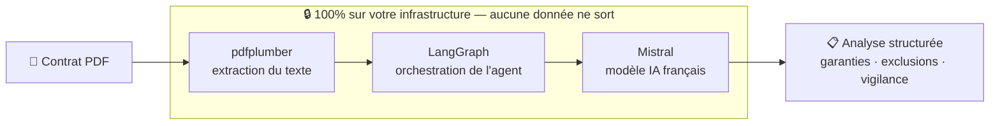

# 🏦 Bank Insurance AI Agent

Agent IA **100% local** pour l'analyse automatique de contrats d'assurance — secteur banque & assurance français.

> ▶️ **[Tester la démo en ligne](https://demo-assurance-ia-68dxswyujbegbvbcwedhjt.streamlit.app/)** — _exemple généré, aucune donnée réelle_

---

## 🎯 Le problème

Dans la banque et l'assurance, analyser un contrat à la main est lent, coûteux et source d'erreurs. Mais les solutions IA basées sur le cloud sont souvent écartées d'office : les contrats contiennent des données sensibles qui ne peuvent pas être envoyées vers une API externe, a fortiori non européenne.

## 💡 Ce que ça fait

Cet agent lit un contrat d'assurance au format PDF et en extrait automatiquement, en moins de 2 minutes :

- les **garanties** et montants couverts,
- les **exclusions** importantes,
- les **points de vigilance** à signaler.

Le tout **sans qu'aucune donnée ne quitte la machine** : le modèle d'IA tourne en local.

👉 **[Essayez la démo interactive](https://demo-assurance-ia-68dxswyujbegbvbcwedhjt.streamlit.app/)** sur un contrat d'exemple.

## ⚙️ Comment ça marche

---

## 📊 Résultats

- ⏱️ Analyse d'un contrat en **moins de 2 minutes**
- 🔍 Extraction automatique des **garanties et exclusions**
- 🔒 **100% local** — zéro donnée envoyée dans le cloud
- 🇫🇷 **Conçu pour faciliter la conformité RGPD** et s'aligner sur les exigences ACPR

## 🛠️ Stack technique

- **Mistral** — modèle IA français
- **LangChain + LangGraph** — orchestration de l'agent
- **Python 3.14**
- **pdfplumber** — extraction du texte des PDF

## 🔐 Souveraineté des données

Conçu spécifiquement pour les contraintes du secteur bancaire français :

- 🇫🇷 Modèle IA français (Mistral)
- 🔒 Traitement 100% local
- 📋 Architecture pensée pour la conformité RGPD
- 🏛️ Compatible avec les exigences ACPR

> ℹ️ **À propos de la démo en ligne :** la version publique fonctionne sur des contrats d'exemple générés. En déploiement réel, le même moteur tourne **entièrement sur votre infrastructure**, sans aucune sortie de données.

---

## 📦 Code source

Le code source est propriétaire. **Démo, présentation technique et déploiement disponibles sur demande.**

## 👤 Auteur

**Mohammed El Jabri**
Expert Data & IA

🔗 LinkedIn : [mohammed-el-jabri](https://www.linkedin.com/in/mohammed-el-jabri-b4435511/)

---

_Ces approches sont directement transposables à des environnements professionnels réels._
